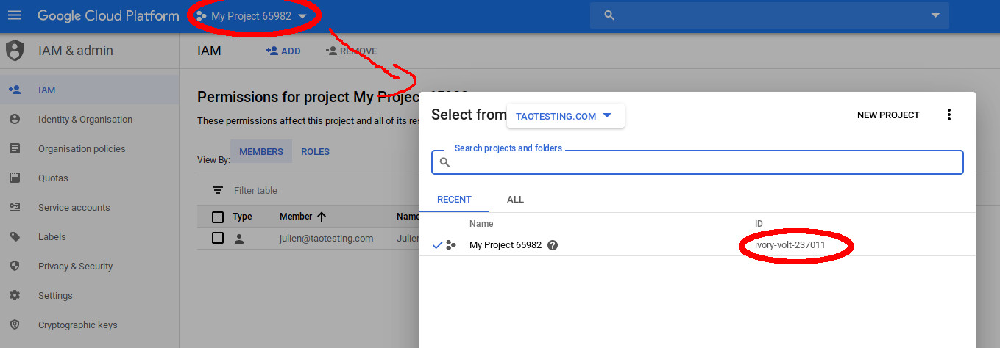

# Use Google Cloud Spanner from php

Following the tutorial here: https://cloud.google.com/spanner/docs/getting-started/php/

## 1. Setup

### gcloud CLI tool

Install and configure gcloud:

```
sudo snap install google-cloud-sdk
```

### Google Cloud Platform credentials

Identify the spanner project:

- Create a new project or select an existing one: https://console.cloud.google.com/cloud-resource-manager
- Find the project ID:



```
gcloud config set project <PROJECT_ID>
```

Get **user account** credentials:

```
gcloud auth application-default login
```

This opens an online authorization page and on completion, stores credentials locally in your home directory: /home/«username»/.config/gcloud/application_default_credentials.json

Then create **service account**, grant permissions and save credentials to a key file of your choice:

```
gcloud iam service-accounts create <SERVICE_NAME>
gcloud projects add-iam-policy-binding <PROJECT_ID> --member "serviceAccount:<SERVICE_NAME>@<PROJECT_ID>.iam.gserviceaccount.com" --role "roles/owner"
gcloud iam service-accounts keys create <JSON_FILE> --iam-account <SERVICE_NAME>@<PROJECT_ID>.iam.gserviceaccount.com
```
- SERVICE_NAME is any name by which you want to designate the service
- JSON_FILE is the file name to which you want to store the service credentials (suggestion: /home/«username»/.config/gcloud/service_account_credentials.json)


Store the «JSON_FILE» full path reference in the GOOGLE_APPLICATION_CREDENTIALS environment variable to allow application auto-login:

```
export GOOGLE_APPLICATION_CREDENTIALS="<JSON_FILE>"
```

You should now be able to run this (should return a list of region configurations):

```
gcloud spanner instance-configs list

NAME                              DISPLAY_NAME
eur3                              Europe (Belgium/Netherlands)
nam-eur-asia1                     United States, Europe, and Asia (Iowa/Oklahoma/Belgium/Taiwan)
nam3                              United States (Northern Virginia/South Carolina)
regional-europe-north1            europe-north1
regional-europe-west1             europe-west1
...
```

### Install gRPC and protobuf extensions

Follow the documentation here:
https://cloud.google.com/php/grpc

The installation of gRPC itself through PECL didn't work for me so I had to compile from sources, following this:
https://github.com/grpc/grpc/tree/master/src/php#build-from-source-with-grpc-c-core-library

Also run the following to install protobuf:

```
sudo pecl install protobuf
```

Finally add the two extensions in php.ini:

```
extension=grpc.so
extension=protobuf.so
```

## 2. Php project

Create a php project with these dependencies:

```
composer require grpc/grpc google/protobuf google/cloud-spanner
```

Create a spanner instance to host your test databases:

```
gcloud spanner instances create php-dbal-tests --config=<REGIONAL_CONFIGURATION> --description="PHP DBAL tests" --nodes=<NUMBER_OF_NODES>
```
- REGIONAL_CONFIGURATION: choose a unique region configuration, for example `regional-europe-west1` (in Belgium). See https://cloud.google.com/compute/docs/regions-zones/
- NUMBER_OF_NODES: for testing purpose, no data replication is needed -> 1 node is enough.

At the end of work, delete the spanner instance to minimize costs:

```
gcloud spanner instances delete php-dbal-tests
```

